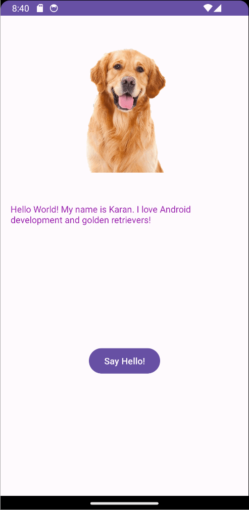

# Android Prework - *Hello World*

Submitted by: **Karan Komal**

**Hello World** is an Android app that shows an image and introductory message, and allows pressing a button to display a Toast. 

Time spent: **4** hours spent in total

## Required Features

The following **required** functionality is completed:

* [X] Image and introductory message displayed on screen
* [X] Button displayed on screen
* [X] Toast with message appears when button is pressed 

The following **optional** features are implemented:

* [X] Customized colors
* [X] Customized text
* [X] Background image
* [X] Rain particles

## Video Walkthrough

Here's a walkthrough of implemented features:

<!-- Replace this with whatever GIF tool you used! -->
GIF created with [ScreenToGif](https://www.screentogif.com/) for Windows. 
<!-- Recommended tools:
[Kap](https://getkap.co/) for macOS
[ScreenToGif](https://www.screentogif.com/) for Windows
[peek](https://github.com/phw/peek) for Linux. -->

## Notes

### **Describe any challenges encountered while building the app:**

The challenge mostly came from finding where exactly to fit the different pieces of the app. Additionally, implementing the weather particles was a bit confusing at first as well. Once that was sorted though, it was just a matter of making sure everything looked relatively nice.

## Credits

* Credit to DevilAkuma on Zedge for the background image,
* Credit to CityPNG for the Neon Cloud icon.
* Credit to MatteoBattilana for [WeatherView](https://github.com/MatteoBattilana/WeatherView).

## License

    Copyright 2023 Karan Komal

    Licensed under the Apache License, Version 2.0 (the "License");
    you may not use this file except in compliance with the License.
    You may obtain a copy of the License at

        http://www.apache.org/licenses/LICENSE-2.0

    Unless required by applicable law or agreed to in writing, software
    distributed under the License is distributed on an "AS IS" BASIS,
    WITHOUT WARRANTIES OR CONDITIONS OF ANY KIND, either express or implied.
    See the License for the specific language governing permissions and
    limitations under the License.
